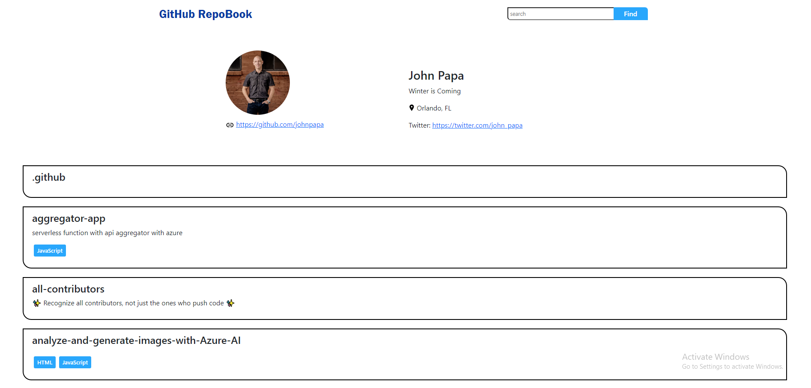

# GitHub Repositiry Listing Page

>About

#### This is a GitHub repository listing page made with purely HTML, CSS, and JavaScript and some classes of Bootstrap. You can run this project on your local computer by following theese steps:

- Download this project from GitHub
- Extract the files and folders from the zip file
- Open the project root folder using VS code or any other source code editor
- Go to index.html
- Open the with Live server and it will go live within a miniute in your installed browser
- (or) you can just double click on index.html file
- Now you are good to go. You can search my GitHub username 'souvikn18' for checking

Since I am not an authenticated user there are some limitations on API calling. All the edge cases are considered. The page is fully responsive for all devices. You can go through the following link for live preview.

### https://github-repositories-listing-page-nine.vercel.app/

### I am attaching some images for better understanding with a valid GitHub user result

- For Desktop

- For Tablet

- For Mobile

### Thank you.